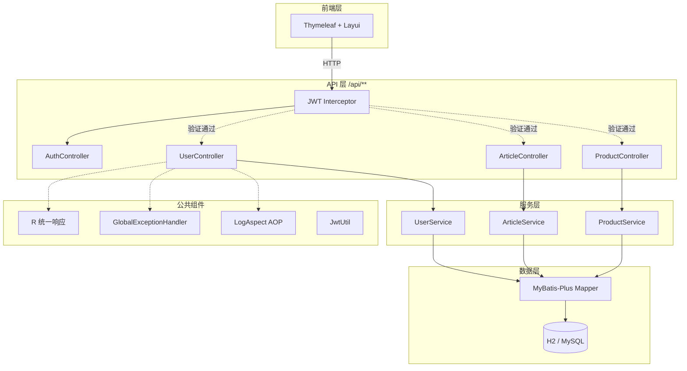
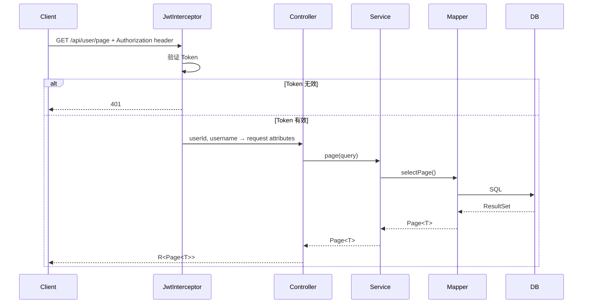

# 架构文档

## 系统概览



## 模块分层

```
src/main/java/com/example/scaffold/
├── ScaffoldApplication.java
├── common/
│   ├── annotation/Log.java
│   ├── aspect/LogAspect.java
│   ├── config/{Knife4jConfig,MyBatisPlusConfig,WebMvcConfig}
│   ├── exception/BusinessException.java
│   ├── handler/GlobalExceptionHandler.java
│   ├── interceptor/JwtInterceptor.java
│   ├── result/R.java
│   └── util/JwtUtil.java
├── generator/CodeGenerator.java
└── module/
    ├── auth/controller/AuthController.java
    ├── user/{controller,entity,mapper,service}
    ├── article/{controller,entity,mapper,service}
    └── product/{controller,entity,mapper,service}
```

## 请求处理流程



## 认证机制

| 层级 | 机制 | 实现 |
|------|------|------|
| 页面路由 | `localStorage` token 检查 | `index.html` JS |
| API 拦截 | `JwtInterceptor.preHandle()` | `WebMvcConfig` 注册 |
| Token 签发 | Hutool JWT (HMAC) | `AuthController.login()` |
| Token 校验 | `JwtUtil.verify()` + `parsePayload()` | 每个 `/api/**` 请求 |

## 数据库设计

开发环境使用 H2 内存数据库（MySQL 兼容），表结构在 `db/schema.sql`。

| 表名 | 说明 | 关键字段 |
|------|------|---------|
| `t_user` | 用户 | username, password(BCrypt), status |
| `t_article` | 文章 | title, content, category, author_id |
| `t_product` | 商品 | name, price, stock, status |

所有表均通过 MyBatis-Plus 配置了逻辑删除（`deleted` 字段）和下划线转驼峰映射。
